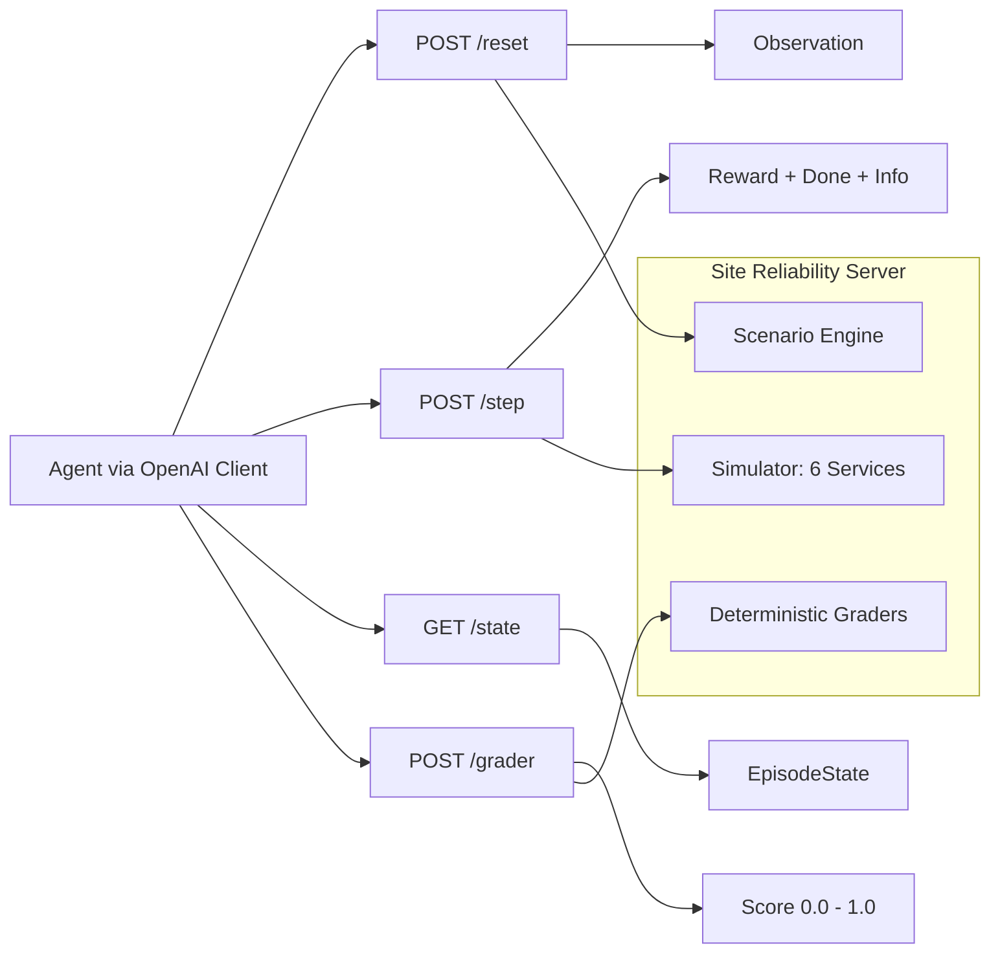
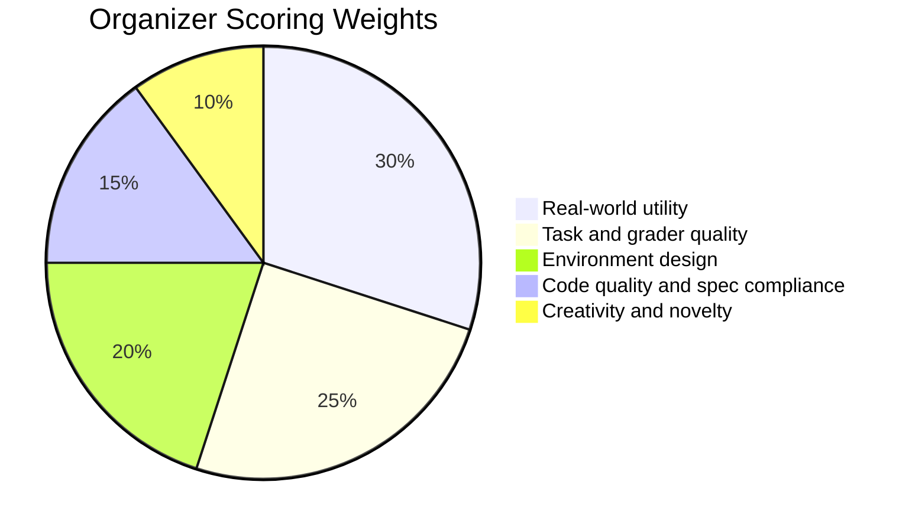

# Site Reliability Server (OpenEnv)

Production-style SRE incident-response environment for training and evaluating AI agents with the standard OpenEnv loop:
`reset()` -> `step(action)` -> `state()`.

## Judge Quick Read

- Real-world utility: production-style SRE incident diagnosis and remediation across dependent microservices.
- OpenEnv compliance: typed Observation, Action, Reward models + `reset/step/state` + `openenv.yaml`.
- Task quality: 4 tasks (`easy`, `medium`, `hard`, `expert`) with deterministic programmatic graders.
- Reward quality: dense per-step signal with progress + latency + penalty terms.
- Reliability gates: HF `/reset` live, Docker build success, OpenEnv validator pass.
- Infra fit: designed for `vcpu=2`, `memory=8gb`, with inference timeout bounded below 20 minutes.

## Why This Matters

- Real-world domain: incident diagnosis and remediation in microservice systems.
- Not a toy: actions have side effects, trade-offs, and partial credit.
- Benchmark value: deterministic graders with clear difficulty progression.

## Visual Overview






## Organizer Requirement Checklist

| Requirement | Status |
|---|---|
| Real-world task simulation | PASS |
| Typed models (Observation/Action/Reward) | PASS |
| OpenEnv API (`reset`, `step`, `state`) | PASS |
| openenv.yaml present and valid | PASS |
| Minimum 3 tasks with deterministic graders | PASS (4 tasks) |
| Reward with partial progress + penalties | PASS |
| `inference.py` in repo root | PASS |
| OpenAI client usage with env vars | PASS |
| Docker build/run | PASS |
| HF Space responds | PASS |

## Submission Evidence Snapshot

- HF gate: `POST /reset` returned HTTP 200 in latest pre-submission check.
- Docker gate: `docker build .` completed successfully on current commit.
- OpenEnv gate: `/Users/siddhesh/Documents/Projects/Cloud-Chaos-SRE/.venv/bin/openenv validate` returned OK.
- Baseline gate: `/baseline` runs completed successfully with `ok=true`, well below 20-minute runtime cap.

## Tasks and Difficulty

| Task | Goal | Max Steps | Grader Output |
|---|---|---:|---|
| easy | Identify root-cause service | 15 | 0.0 to 1.0 |
| medium | Recover all key health metrics | 15 | 0.0 to 1.0 |
| hard | Fix hidden config regression | 20 | 0.0 to 1.0 |
| expert | Resolve multi-cause cascade | 25 | 0.0 to 1.0 |

### What Makes Each Task Hard

- easy: requires causal root-cause reasoning, not random restarts.
- medium: requires balancing multiple metrics, not optimizing only one.
- hard: requires config-level diagnosis from deploy/config context.
- expert: requires ordered recovery under cascading multi-service failure.

## Observation and Action Spaces

### Observation (typed)
- `step`, `max_steps`, `task_id`
- `metrics` (cpu, memory, error_rate, latency)
- `logs`, `deploy_history`, `current_config`
- `service_graph`, `active_alerts`, `health_summary`

### Action (typed)
- `action_type`: CHECK_LOGS, INSPECT_SERVICE, RESTART_SERVICE, SCALE_UP, SCALE_DOWN, ROLLBACK, UPDATE_CONFIG, SILENCE_ALERT
- `target_service`: one of six services
- `config_key`, `config_value` (for UPDATE_CONFIG)
- `reason`

## Reward Design (Meaningful, Non-Sparse)

Per-step signal combines:
- health improvement (primary)
- latency improvement
- cost-awareness
- penalties for invalid/repeated low-value actions

This gives dense learning feedback instead of only end-of-episode binary success.

## Quick Start

```bash
# 1) Install
pip install -r requirements.txt

# 2) Generate scenarios
python env/data_generator.py

# 3) Set required vars
export OPENAI_API_KEY=<your_key>
export API_BASE_URL=https://api.groq.com/openai/v1
export MODEL_NAME=llama-3.3-70b-versatile
export HF_TOKEN=<your_hf_token>

# 4) Run server
uvicorn main:app --host 0.0.0.0 --port 7860

# 5) Run baseline
python inference.py --output-json
```

## API Endpoints

- `POST /reset`
- `POST /step`
- `GET /state`
- `GET /tasks`
- `POST /grader`
- `POST /baseline`
- `GET /health`

## Baseline Notes

- Uses OpenAI client only.
- Reads `OPENAI_API_KEY`, `API_BASE_URL`, `MODEL_NAME`, `HF_TOKEN` from environment.
- `MODEL_NAME` is configurable; examples in this README use `llama-3.3-70b-versatile` as the recommended default.
- Enforced runtime limit < 20 minutes (script timeout set to 19 minutes).
- Output written to `baseline_scores.json`.
- Reproducibility is designed to be stable with bounded variance (not necessarily bit-identical across every run due to LLM infra variability).

## Infra Constraints

Designed for low-resource evaluation:
- `vcpu=2`, `memory=8gb`
- Pure in-memory simulation
- No external DB required

## Docker

```bash
docker build -t site-reliability-server .
docker run -p 7860:7860 site-reliability-server
curl http://localhost:7860/health
```

## Pre-Submission Validator (Organizer Style)

```bash
# HF ping
curl -s -o /dev/null -w '%{http_code}' -X POST \
  -H 'Content-Type: application/json' -d '{}' \
  https://siddheshkadane-cloud-chaos-sre.hf.space/reset

# Docker build
docker build .

# OpenEnv validate (venv path-safe)
/Users/siddhesh/Documents/Projects/Cloud-Chaos-SRE/.venv/bin/openenv validate
```

If all three pass, submission is ready.

## Project Structure

```text
site-reliability-server/
├── main.py
├── inference.py
├── openenv.yaml
├── Dockerfile
├── requirements.txt
├── readme.md
├── env/
└── scenarios/
```
